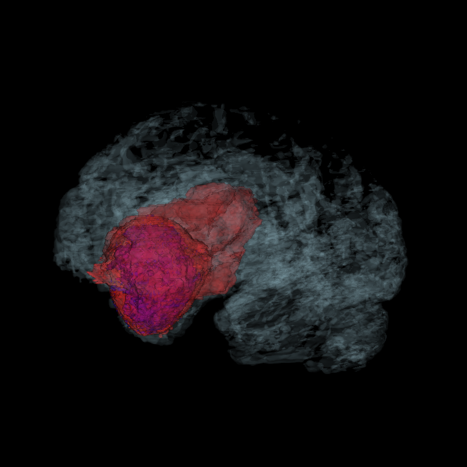
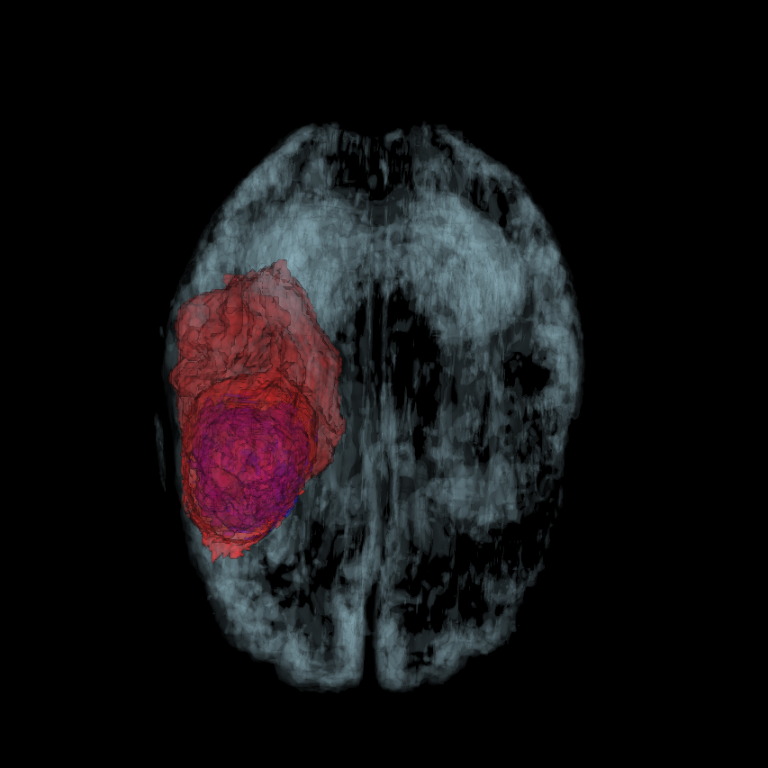

<h1 align="center">
  (WIP) Tumor Segmnetation With Vision Transformers
   
</h1>

  

    
     
    3D Sample View 1
  

  

    
     
    3D Sample View 2
  

## Training Image: 4 modalities

shape: (240, 240, 155, 4)

channel 0 — FLAIR    best for seeing edema / whole tumor extent  
channel 1 — T1       baseline anatomy, tumor appears dark  
channel 2 — T1gd     enhancing tumor lights up bright (gadolinium)  
channel 3 — T2       fluid and infiltration, complements FLAIR  

## Lables: Raw Integer Classes

shape: (240, 240, 155)

0 — background / healthy brain   (vast majority of voxels)  
1 — NCR/NET   necrotic core      (dead tissue, center of tumor)  
2 — ED        edema              (swelling around tumor)  
3 — ET        enhancing tumor    (active growth, lights up on T1gd)  

| Region        | Raw Integer Lable                             |
|---------------|-----------------------------------------------|
| Whole Tumor   | (label = 1) + (label = 2) + (label = 3)       |
| Tumor Core    | (label = 1) + (label = 3)                     |
| Enhancing     | (label = 3)                                   |

with `ConvertToMultiChannelBasedOnBratsClassesd` we have:  

Takes raw integer values and classifz them into 3 seperate classes, replacing raw integer with binary   
shape: (3, 240, 240, 155)

channel 0 — Tumor Core  (TC)  =  label 1 + label 3  
channel 1 — Whole Tumor (WT)  =  label 1 + label 2 + label 3  
channel 2 — Enhancing Tumor  (ET)  =  label 3 only  

## In Plain English

TC — what needs to be surgically removed?  
WT — how much brain is affected overall?  
ET — where is active tumor **growth** happening?  

## What each modality tell us

### FLAIR → best for Whole Tumor / Edema (ED)  

**FLAIR** suppresses normal fluid so the edema ring around the tumor appears bright white. It shows the full extent of tumor involvement better than any other sequence. If you only had one modality to delineate the whole tumor boundary, you'd pick FLAIR.

### T1gd → best for Enhancing Tumor (ET)

**T1gd** is the reason ET can be identified at all. ET lights up bright on **T1gd** and is nearly invisible on every other modality. The gadolinium contrast agent physically accumulates where the blood-brain barrier has broken down, which is exactly where active tumor growth is happening.  

### T1 + T1gd together → best for Tumor Core (NCR)

Necrotic tissue appears dark on **T1** but the contrast between necrosis and the enhancing rim around it is most visible when you compare **T1** and **T1gd** side by side. On **T1gd** the enhancing rim is bright, the necrotic center is dark. This that contrast reveals the core boundary.

### T2 → complements FLAIR for edema

**T2** also shows edema brightly but without suppressing the CSF, so it picks up slightly different aspects of infiltration. Used alongside **FLAIR** it helps distinguish edema from other fluid.
